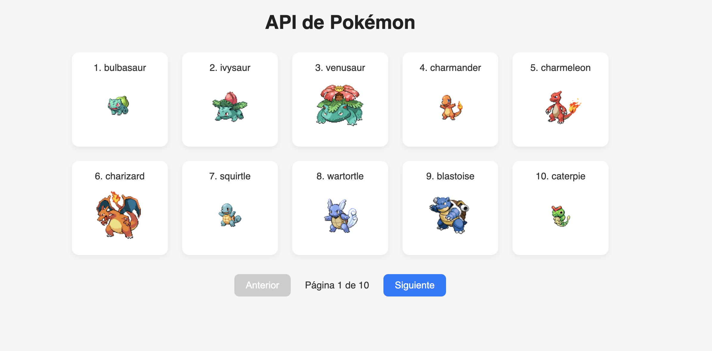

# Api-pokemon

# 🐱‍👤 Proyecto Vue - Consumo de la PokéAPI

Este proyecto es una aplicación hecha en Vue 3 que consume la [PokéAPI](https://pokeapi.co) para mostrar una lista de Pokémon con paginación e imágenes minimalistas.

## 🔥 Vista previa

## 🚀 Tecnologías

- ⚡ Vue 3
- 🎨 CSS puro y minimalista
- 📦 Axios para peticiones HTTP

## 📸 Ejemplo de Pokémon mostrados

Aquí algunos sprites que se cargan directamente desde la API:

| Nombre     | Imagen                                                                                        |
| ---------- | --------------------------------------------------------------------------------------------- |
| Bulbasaur  |   |
| Charmander |  |
| Squirtle   |    |

## 📂 Estructura del Proyecto
